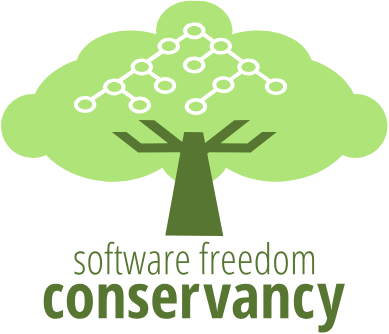

<!-- header: "FOSS Backstage 2025" -->
<!-- paginate: skip -->
# 🩵 Anatomy of an open internship program: How we run Outreachy
## Anna e só (they/them), lead Outreachy organizer

---
# 🩵 Outreachy is...

 A Software Freedom Conservancy initiative

---

# 🩵 Outreachy is...

 A collective effort! (CC BY-SA Justin W. Wheeler)

---
<!-- header: "FOSS Backstage 2025 > Anatomy of an open internship program > Out of scope" -->
# Out of scope
## Program history
- 📺 **Watch:** Joint FOSDEM 2024 keynote: ["Outreachy: 1,000 interns"](https://archive.fosdem.org/2024/schedule/event/fosdem-2024-2522-outreachy-1000-interns/);
- 📺 **Watch:** Marina Zhurakhinskaya's talk ["Outreach Program for Women: Lessons in collaboration"](https://www.youtube.com/watch?v=O3O2HVcH-e0).
## Some program details
- 📺 **Watch:** [Initial applications] Our livestream ["Let's talk about initial applications"](https://www.youtube.com/watch?v=Ji2lgR3_Aww);
- 📺 **Watch:** [Mentoring] Our [coffee chats with Outreachy mentors](https://www.youtube.com/playlist?list=PLrLAI1zTsX5A0nu8epYt78YiDEJnDMRJ_);
- 📺 **Watch:** [Mentoring] Our [livestream series for mentoring communities](https://www.youtube.com/playlist?list=PLrLAI1zTsX5BFRNRN2CE4eNyHUk3peV_r);
- 📺 **Watch:** [Website dev] Sage Sharp's talk ["Herding cats with Django"](https://www.youtube.com/watch?v=N3UmdNfNWgg).

---
<!-- header: "FOSS Backstage 2025 > Anatomy of an open internship program > Views of Outreachy" -->

<h1>Views of Outreachy</h1>

<h2>🌱 External view</h2>
<ul>
    <li>Increasing diversity in FOSS;</li>
    <li>Offering 3-month internships;</li>
    <li>Paying a U$7,000 stipend.</li>
</ul>

<h2>🌳 Internal view</h2>
<li>Running two cohorts a year;</li>
<li>Managing both cohorts in parallel;</li>
<li>Supporting thousands every year.</li>

---
<!-- header: "FOSS Backstage 2025 > Anatomy of an open internship program > Views of Outreachy" -->
# 🩵 We welcome an average of 30 mentoring organizations, 150 mentors, 60 coordinators, 5,000 applicants, and 80 interns per year.
---
<!-- header: "FOSS Backstage 2025 > Anatomy of an open internship program > Phases of Outreachy" -->

# Phases of Outreachy
## 🌀 What constitutes a program cycle?
- 1 month of preparation — determining cohort dates; reaching out to volunteers, communities, sponsors;
- 3 months of public "high traffic" processes: call for communities and projects; initial applications; contribution period; final applications; intern selection.
- 3 to 4 months of internships (including possible extensions).

---
<!-- header: "FOSS Backstage 2025 > Anatomy of an open internship program > Phases of Outreachy" -->
# 🔎 Point of view: Applicants
1. **Initial application**
   1. Answering essay and eligibility questions
2. **Contribution period**
   1. Picking communities
   2. Submitting & recording contributions
3. **Final application**
   1. Creating a project timeline
   2. Answering community-specific questions
      1. Following community-specific procedures
---
# 🔎 Point of view: Applicants
4. **Internship period**
   1. Signing an intern agreement
   2. Submitting tax forms and payment information
   3. Working with mentors, coordinators and their community!
   4. Submitting feedback (n = 4)
   5. Writing blog posts (n = 6)
   6. Participating in intern chats (n = 7)
---
# 🔎 Point of view: Participating communities
1. **Call for participation**
   1. Finding sponsorship leads
   2. Assessing mentorship capacity
2. **Call for projects**
   1. Submitting project proposals
3. **Contribution period**
   1. Interacting with applicants
   2. Reviewing and approving contributions
4. **Intern selection**
   1. Evaluating final applications
   2. Ranking applicants
---
# 🔎 Point of view: Participating communities
5. **Internship period**
   1. Signing a mentor agreement
   2. Guiding and supporting our interns
   3. Keeping track of our interns' public work
   4. Submitting feedback (n = 4)
   5. Participating in intern chats (n = 6)
   6. Authorizing stipend payments (n = 2)
---
# 🔎 Point of view: Program organizers
1. **Call for initial applications**
   1. Reviewing initial applications
2. **Call for participation**
   1. Vetting new communities
   2. Reaching out to past communities
3. **Call for projects**
   1. Reviewing projects
4. **Contribution period**
   1. Following up with sponsorship leads
5. **Intern selection**
   1. Reviewing and mediating selections
---
# 🔎 Point of view: Program organizers

6. **Internship period**
   1. Handling intern and mentor agreements
   2. Monitoring and checking in with interns, mentors, coordinators 🔁
      1. Mediating issues and conflicts
      2. Processing internship extensions
   3. Mediating bi-weekly assignments (n = 7)
   4. Facilitating bi-weekly intern chats (n = 7)
   5. Reviewing feedback submissions (n = 4)
   6. Handling stipend payment authorizations 🔁
---
<!-- header: "FOSS Backstage 2025 > Anatomy of an open internship program > The formula" -->
# 🤔 But what makes Outreachy so special?
---
<!-- header: "FOSS Backstage 2025 > Anatomy of an open internship program > The formula" -->
# 🧪 Ingredient #1: A systemic approach

---
<!-- header: "FOSS Backstage 2025 > Anatomy of an open internship program > Ingredient #1: A systemic approach" -->
# “Outreachy provides internships to people subject to systemic bias and impacted by underrepresentation in the technical industry where they are living.”

---
<!-- header: "FOSS Backstage 2025 > Anatomy of an open internship program > Ingredient #1: A systemic approach" -->
# “Outreachy provides internships to people subject to **systemic bias** and impacted by **underrepresentation** in the technical industry where they are living.”

---
<!-- header: "FOSS Backstage 2025 > Anatomy of an open internship program > Ingredient #1: A systemic approach" -->
# 🩵 Because our lives are complex
- Marginalization intersects and interweaves in many different ways;
- We focus on the *structural manifestations* of marginalization — the impact on our applicants' lives.
---
<!-- header: "FOSS Backstage 2025 > Anatomy of an open internship program > Ingredient #1: A systemic approach" -->
# 🩵 Outreachy internship projects include **more than just programming**! 
---
<!-- header: "FOSS Backstage 2025 > Anatomy of an open internship program > Ingredient #1: A systemic approach" -->
# 🩵 Because open source is also complex
- FOSS is much more than just programming!
- We train software engineers and architects, designers, community managers, security researchers, technical writers, scientists...
---
<!-- header: "FOSS Backstage 2025 > Anatomy of an open internship program > The formula" -->
# 🧪 Ingredient #2: A structured intro to FOSS
---
<!-- header: "FOSS Backstage 2025 > Anatomy of an open internship program > Ingredient #2: A structured introduction to FOSS" -->
# 🩵 A built-in exposition
- A structured contribution period with **beginner-friendly tasks**;
- Recording contributions is **mandatory** to move forward;
- Collaboration, not competition — **applicants are encouraged to help each other**.

---
<!-- header: "FOSS Backstage 2025 > Anatomy of an open internship program > Ingredient #2: A structured introduction to FOSS" -->
# 🩵 We offer
- Thematic bi-weekly assignments for mentors and interns;
- Thematic bi-weekly intern chats with interns, mentors, coordinators, and alums.

---
<!-- header: "FOSS Backstage 2025 > Anatomy of an open internship program > Ingredient #2: A structured introduction to FOSS" -->
# 🩵 We tackle
- Working remotely and “in the open”;
- Struggles and the fear of failure;
- Open source conferences;
- Careers in open source;
- Informal chats with industry peers;
- Continuation of their journey in open source.

---
<!-- header: "FOSS Backstage 2025 > Anatomy of an open internship program > Ingredient #2: A structured introduction to FOSS" -->

# 🩵 Paradigm shift: From passive usage to **becoming an active agent of change**!

---
<!-- header: "FOSS Backstage 2025 > Anatomy of an open internship program > The formula" -->
# 🧪 Ingredient #3: A human-centered design

---
<!-- header: "FOSS Backstage 2025 > Anatomy of an open internship program > Ingredient #3: A human-centered design" -->

# 🩵 We strive for **personal growth** over project completion

Mentors have heard us say "Outreachy is more like a fellowship" several times. Promoting it as an internship program, however, is still important to encourage newcomers to give it a try!

---

<!-- header: "FOSS Backstage 2025 > Anatomy of an open internship program > Ingredient #3: A human-centered design" -->

# 🩵 We facilitate success
- Full-time effort = putting in 30 hours/week;
- Internships have a built-in 1-week buffer — interns are required to work 12 out of the 13 weeks of the internship;
- We can arrange internship extensions of up to 5 weeks — to be used in the occurrence of emergencies or other life circumstances.
  - **We don't extend internships for the sole purpose of completing an internship project.**
---
<!-- header: "FOSS Backstage 2025 > Anatomy of an open internship program > The formula" -->

# 🧪 Ingredient #4: A high-touch philosophy

---

<!-- header: "FOSS Backstage 2025 > Anatomy of an open internship program > Ingredient #4: A high-touch philosophy" -->

# 🩵 We monitor and mediate
* Mentors and interns go through 4 cycles of evaluation (informally known as Feedback #1, #2, #3, and #4);
* Organizers mediate and facilitate conversations with and between mentors and mentees when issues arise.
---

<!-- header: "FOSS Backstage 2025 > Anatomy of an open internship program > Ingredient #4: A high-touch philosophy" -->

# 💔 Signs of trouble
* Missing meetings or other established contact points;
* No opportunities for private 1:1 communications;
* No opening to share struggles and work together towards a solution;
* No interest in introducing the intern to other community members;
* No interest in talking about career development or goals.
---
<!-- header: "FOSS Backstage 2025 > Anatomy of an open internship program > Ingredient #4: A high-touch philosophy" -->
# 💔 When does an internship fail?
- When interns are treated as mere independent contractors, and they aren't offered opportunities to learn and grow;
- When we witness a dramatic and significant decrease in communications between an intern and their mentors;
- When we notice a frequent and combative refusal to listen and incorporate feedback.
---

<!-- header: "FOSS Backstage 2025 > Anatomy of an open internship program > The formula" -->

# 🧪 Ingredient #5: A deep meta understanding of the FOSS ecosystem

---

<!-- header: "FOSS Backstage 2025 > Anatomy of an open internship program > Ingredient #5: A deep meta understanding of the FOSS ecosystem" -->

# 🩵 We have 15+ years of experience in supporting FOSS communities
- We facilitate structural changes in the onboarding of new community members;
- We've developed a deep meta understanding of what a good mentorship entails.

---
<!-- header: "FOSS Backstage 2025 > Anatomy of an open internship program > Ingredient #5: A deep meta understanding of the FOSS ecosystem" -->
# 🩵 We know that a good mentorship initiative...
- ... welcomes the perspective of newcomers, and recognizes that not everything may seem "obvious" from the start;
- ... transforms once restricted communal knowledge into something tangible, trackable, and shareable;
- ... creates, maintains, and promotes opportunities for growth — including a path to maintainership and leadership.

---
<!-- header: "FOSS Backstage 2025 > Anatomy of an open internship program > Ingredient #5: A deep meta understanding of the FOSS ecosystem" -->
# 🩵 So we're laying the groundwork to create an Open Mentorship Initiative—we will...
- ... document open mentorship practices across FOSS communities;
- ... create an Open Mentorship Handbook;
- ... help communities become "Outreachy ready";
- ... mentor mentors!
- First discussions to take place at DISC Unconference 2025 — stay tuned!
- Want to be part of it? Let's talk!

---
<!-- header: "FOSS Backstage 2025 > Anatomy of an open internship program > Ingredient #5: A deep meta understanding of the FOSS ecosystem" -->
# 🩵 We love what we do
- **All program organizers have mentored someone and/or been mentored in Outreachy or similar programs.**
  - I'm a proud alum of Outreachy itself (December 2017 cohort with Wikimedia), Mozilla Open Leaders (Cohort 6), Google Season of Docs (August 2019 cohort with Open Collective) and Infuse (August 2024 cohort). 👋🏻
- **We believe that everyone should have an opportunity to actively participate in the development of FOSS, regardless of their background**.

---
<!-- header: "FOSS Backstage 2025 > Anatomy of an open internship program > Our constraints" -->
# 😓 Our constraints

---

<!-- header: "FOSS Backstage 2025 > Anatomy of an open internship program > Our constraints" -->
# 🚧 Constraint: Mentorship capacity
* Mentors may be laid off, burn out, change companies, focus, or careers;
* Mentors may not have the capacity to mentor prospect mentors;
* Mentoring communities may struggle to find successors.

---
<!-- header: "FOSS Backstage 2025 > Anatomy of an open internship program > Our constraints" -->
# 🚧 Constraint: Program funding
* We're struggling to find funding for our core activities;
* Our ability to fund the participation of mentoring communities through our Outreachy general fund has decreased.
---
<!-- header: "FOSS Backstage 2025 > Anatomy of an open internship program > Our constraints" -->
# 💔 Our ongoing struggle to find funding is a serious threat to our program.
# An **existential** threat.

---

# 💔 If you'd like more insight into our funding situation, please read our blog post:
# ➡️ [Outreachy needs your help!](https://www.outreachy.org/blog/2024-08-14/outreachy-needs-your-help/)

---
<!-- header: "FOSS Backstage 2025 > Anatomy of an open internship program > Our constraints" -->
# 💔 And talking about the elephant in the room—hostility towards programs like ours is **on the rise**.
---
<!-- header: "FOSS Backstage 2025 > Anatomy of an open internship program > Our ceiling, or a provocation" -->
# 💥 Our ceiling, or a provocation

---
<!-- header: "FOSS Backstage 2025 > Anatomy of an open internship program > Our ceiling, or a provocation" -->
# 💬 I keep hearing talks about the “greying open source community”, and how FOSS struggles to engage with us, younger generations, to take on the work of those who came before us.
---

<!-- header: "FOSS Backstage 2025 > Anatomy of an open internship program > Our ceiling, or a provocation" -->

# 🗯️ Well, _Outreachy_ brings incredible young people to FOSS every year, but is FOSS supporting the permanence of my generation?

---
<!-- header: "FOSS Backstage 2025 > Anatomy of an open internship program > Our ceiling, or a provocation" -->
# 🗯️ Where is the path to help us climb to leadership and/or maintainership?

---
<!-- header: "FOSS Backstage 2025 > Anatomy of an open internship program > Our ceiling, or a provocation" -->
# ✨ 80% of Outreachy alumni continue to be involved with open source after their internship at some capacity (paid or volunteer).
---
<!-- header: "FOSS Backstage 2025 > Anatomy of an open internship program > Our ceiling, or a provocation" -->

# 🩵 Outreachy interns are everywhere!

(CC BY Outreachy)

---
<!-- header: "FOSS Backstage 2025 > Anatomy of an open internship program > Our ceiling, or a provocation" -->
# 💡 Outreachy is a hidden dependency of the free software ecosystem.
---
<!-- header: "FOSS Backstage 2025 > Anatomy of an open internship program > Our ceiling, or a provocation" -->
# 🌐 Outreachy is living proof that the Global Majority and younger generations are *very* enthusiastic about FOSS!

---
<!-- header: "FOSS Backstage 2025 > Anatomy of an open internship program > Our ceiling, or a provocation" -->
# 🌎 But free software culture is still homogeneous and Global North-centered.

---
<!-- header: "FOSS Backstage 2025 > Anatomy of an open internship program > Our ceiling, or a provocation" -->
# 💥 How much of the perceived lack of younger contributors isn't a rejection of diversity?

---
<!-- header: "FOSS Backstage 2025 > Anatomy of an open internship program > Our ceiling, or a provocation" -->
# 💥 How much of the perceived lack of younger contributors isn't a reflection of structural failures within FOSS?

---
<!-- header: "FOSS Backstage 2025 > Anatomy of an open internship program > Our ceiling, or a provocation" -->
# 💥 Places that are too distant to reach. Visas that were denied. Required funds we can't spend. Recognition we don't get — even though we _deserve_ it.

---
<!-- header: "FOSS Backstage 2025 > Anatomy of an open internship program > Our ceiling, or a provocation" -->
# ✨ The new generation of FOSS leaders, contributors, and activists is already here.
# 🩵 Outreachy has trained us.

---
<!-- header: "FOSS Backstage 2025 > Anatomy of an open internship program > Our ceiling, or a provocation" -->
# 🪜 FOSS communities need to stop reaching for mirrors. Bring us ladders. *Make room*.

---
<!-- header: "FOSS Backstage 2025 > Anatomy of an open internship program > Call to action" -->
# 🩵 Help us continue our phenomenal work:
# ➡️ [Sponsor Outreachy!](https://www.outreachy.org/sponsor/)

---
<!-- header: "FOSS Backstage 2025 > Anatomy of an open internship program > Call to action" -->
# 🌳 Follow Outreachy
# ➡️ Our website: [outreachy.org](https://outreachy.org)
# ➡️ In the fediverse: @outreachy@hachyderm.io

---
<!-- header: "FOSS Backstage 2025 > Anatomy of an open internship program > Thank you" -->

# 🩵 Let's continue this conversation!

# 👋🏻 Talk to me...
# ➡️ ... in the hallways;
# ➡️ ... in the fediverse: @anna@friend.camp;
# ➡️ Old-fashioned? Send me an email: `anna@outreachy.org`.
